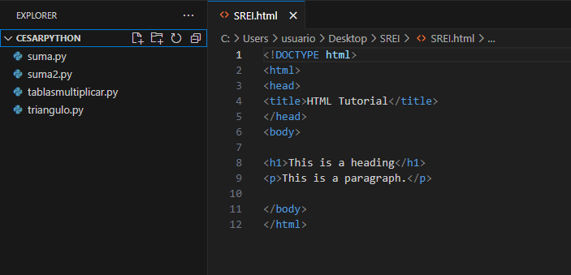
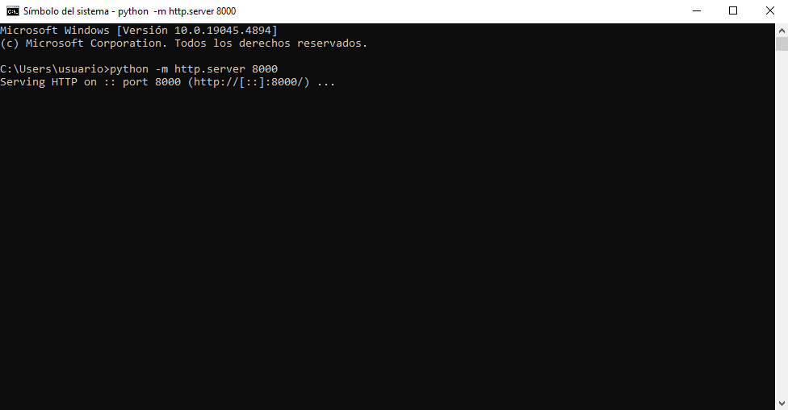
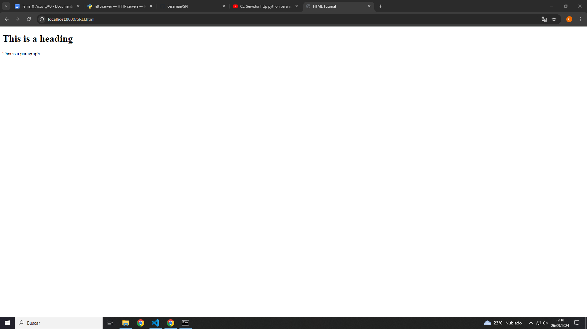
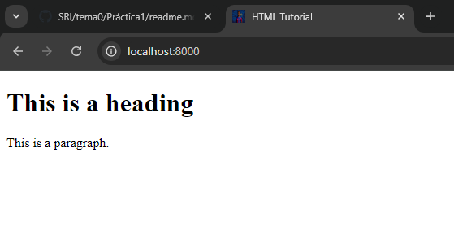

# Practica 1: 
En primer lugar vamos a crear nuestro sitio web utilizando Visual Studio Code y cogiendo un ejemplo de página html de W3Shcools

 

Ahora vamos a crear nusestro propio server utilizando python. Para ello uilizaremos el siguiente comando: python -m http.server 8000

 

Una vez abierto el servidor procemos a buscar en nuestro navegador "localhost:8000"

 

A continuacion cambiaremos la imagen del servidor, para  ello descargamos una imagen y le cambairemos el nombre a "favicon" y su extension a ".ico" 

 

Y por ultimo ya una vez cambiado el nombre lo metemos en la ruta del servidor y vemos como queda.

 
