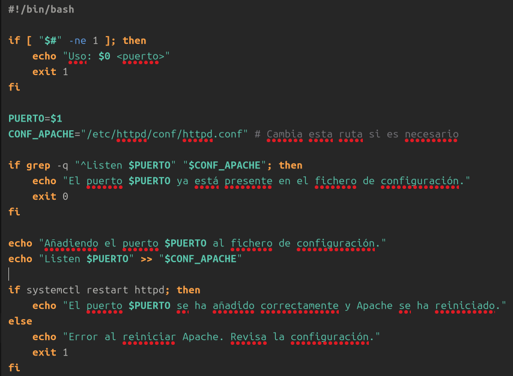
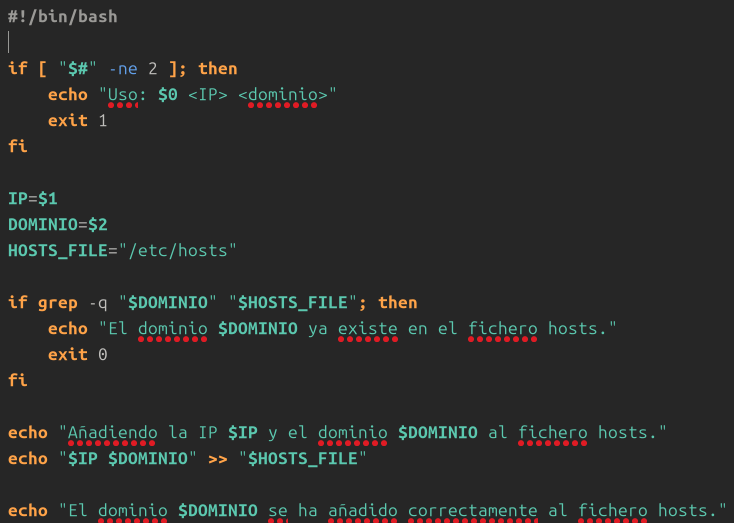

1. Crea un script que añada un puerto de escucha en el fichero de configuración de Apache. El puerto se recibirá como parámetro en la llamada y se comprobará que no esté ya presente en el fichero de configuración.

     

2. Crea un script que añada un nombre de dominio y una ip al fichero hosts. Debemos comprobar que no existe dicho dominio en el fichero hosts
   
     

3. Crea un script que nos permita crear una página web con un título, una cabecera y un mensaje

       

