# Usando una instancia AWS debemos instalar Apache con las siguientes opciones de configuración:
En primer lugar ejecutamos los siguientes comandos para actualizar paquetes e instalamos Apache

## 1. Activar la autenticación con MySql

**Instalamos PHP y MARIADB**

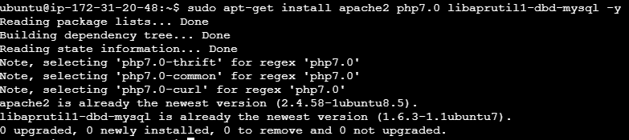

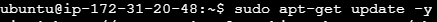

**Activación servicios**

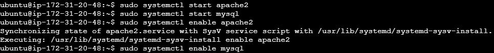

**Entramos a mysql y creamos la base de datos**

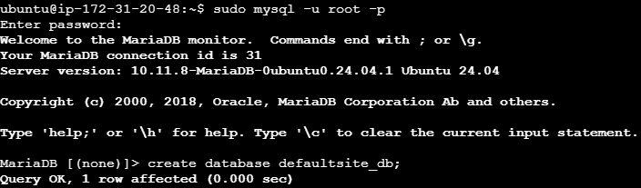

**Otorgamos permisos al admin**

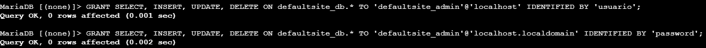

**Entramos a la base de datos**

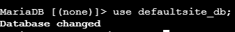

Creamos una tabla para usuarios 

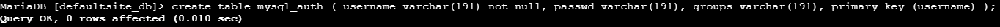

**Pasamos contraseña a hash**

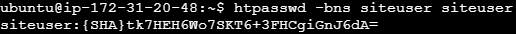

**Insertamos datos en la tabla creada**

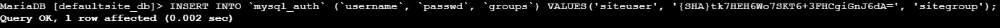

**Habilitamos modulos correspondientes**

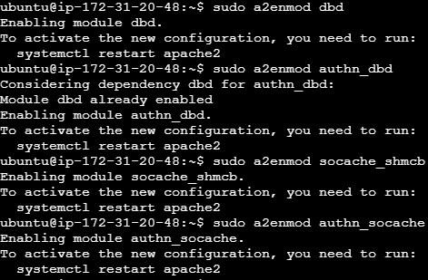

**Creación directorio protegido**

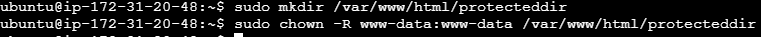

**Modificamos fichero de configuración**

Y tiene que quedar de la siguiente manera:

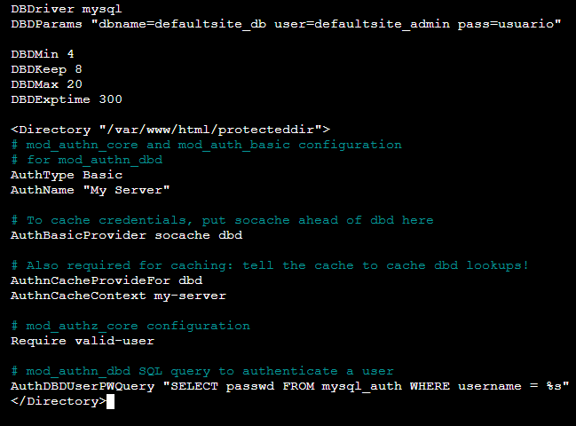

Una vez hecho reiniciamos apache

**A continuación accedemos al directorio poniendo ip/protecteddir**

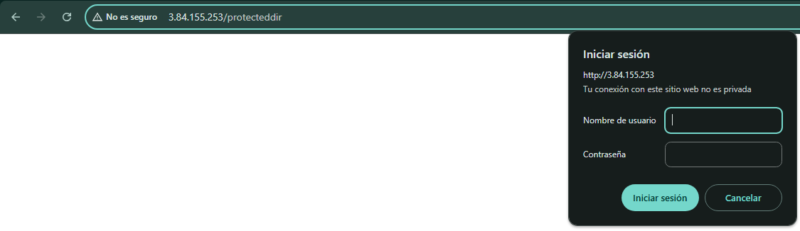

Y vemos comos nos pide usuario y contraseña

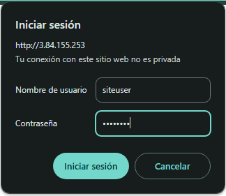

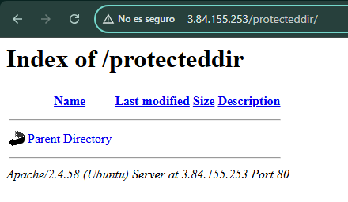

## 2. Crear un certificado autofirmado y activar el módulo SSL

**Abrimos los puertos y activamos el modulo correspondiente**

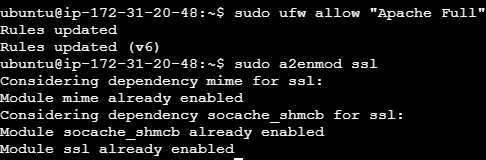

**Procedemos a crear el certificado**

Y lo configuramos de la siguiente manera **(todo es opcional menos nuestra ip)**

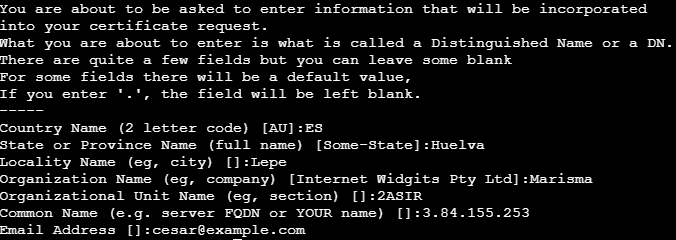

**Ahora modificamos fichero configuración:**

Añadiendo lo siguiente:

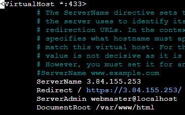

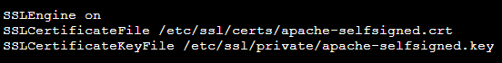

Una vez configurado podemos observar el certificado SSL autofirmado:

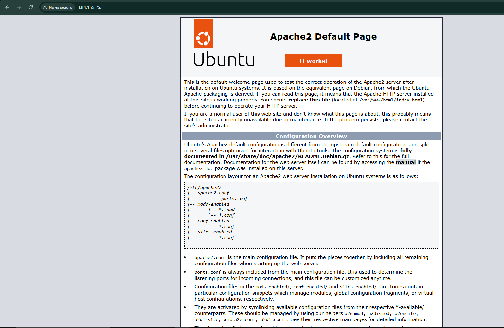

