# Trabajo 1º Trimestre.Servidores Web
## 1. Instalación del servidor web apache. Usaremos dos dominios mediante el archivo hosts: centro.intranet(wordpress) y departamentos.centro.intranet(Python)

**Instalación** servidor web apache:

 

**Comprobacion** de que esta bien instalado:

 

## 2.Activar los módulos necesarios para ejecutar php y acceder a mysql

**Instalación** MySQL:

 

**Comprobación**:

 
 
**Instalación** PHP:

 
 

**Comprobación**:

 

 **Creacion dominios mediante el archivo hosts:**

 
 
 **Comprobacion**:
 
 http://centro.intranet/

 

 http://departamentos.centro.intranet/

 

## 3. Instalar y configurar wordpress(centro.intranet)

**Instalacion en centro.intranet**

**Descomprimimos la carpeta**

**La movemos a nuestro directorio**

Ahora vamos a **configurar y habilitar el fichero virtualhost:**

**Entramos a centro.intranet**

**Creamos base  de datos**

**Creamos usuario y le  damos permiso**

**Instalamos wordpress**

Siguiendo los siguientes pasos  **modificamos  archivo  wp-config.php** utilizando como  **plantila wp-config.sample.php**

**Terminamos la instalacion**

**Finalmente queda instalada**

**Iniciamos sesión**

**Y hasta aqui la  instalacion de  wordpress en centro.intranet**

## 4. Activar el módulo “wsgi” para permitir la ejecución de aplicaciones Python

**Instalanmos el módulo**

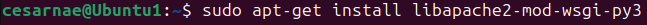

**Lo habilitamos**

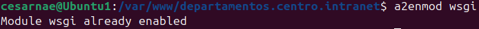

**Configuramos virtualhost**

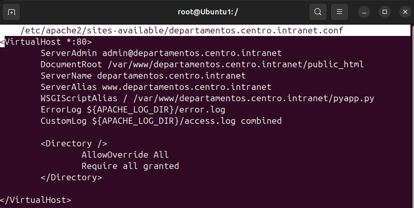

**Lo habilitamos**

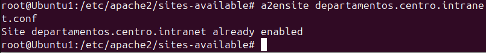

### 4.1 Crea y despliega una pequeña aplicación python para comprobar que funciona correctamente.

**Creamos archivo py**

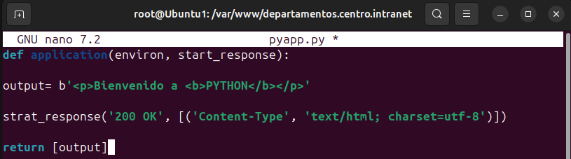

**Archivo ya creado**

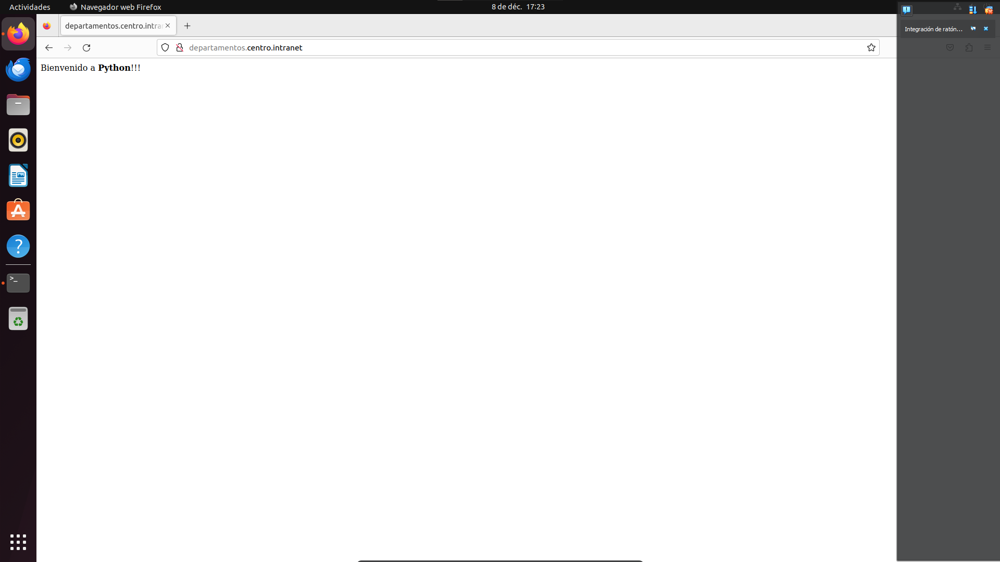

### 4.2 Adicionalmente protegeremos el acceso a la aplicación python mediante autenticación

**Creamos archivo para usuario y contraseña**

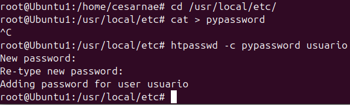

**Cuando intentamos iniciar nos pide usuario/contraseña**

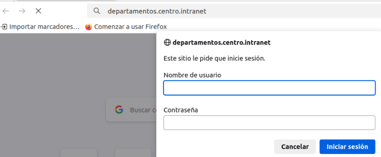

## 5. Instala y configura awstat.

**Creamos archivo para usuario y contraseña**

**Instalamos awstats**

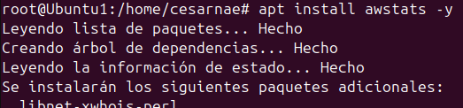

**Acitvamos cgi**

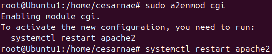

**Configuramos awstats**

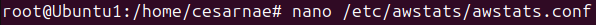

**Editamos y ponemos nuestro dominio y host**

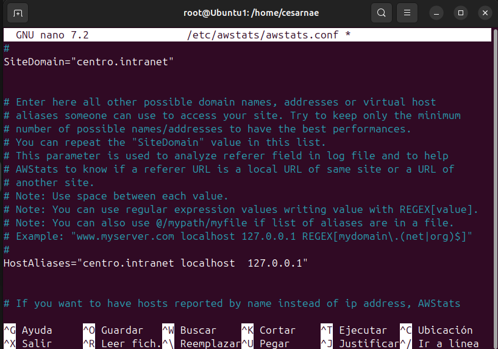

**Activamos la siguiente opcion cambiando 0 por 1**

**Configuramos apache**

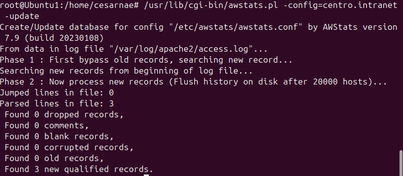

**Otorgamos permisos**

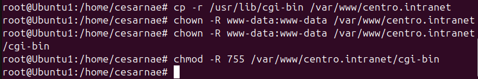

**Modificamos archivo poniendo lo siguiente**

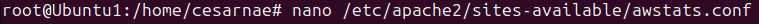

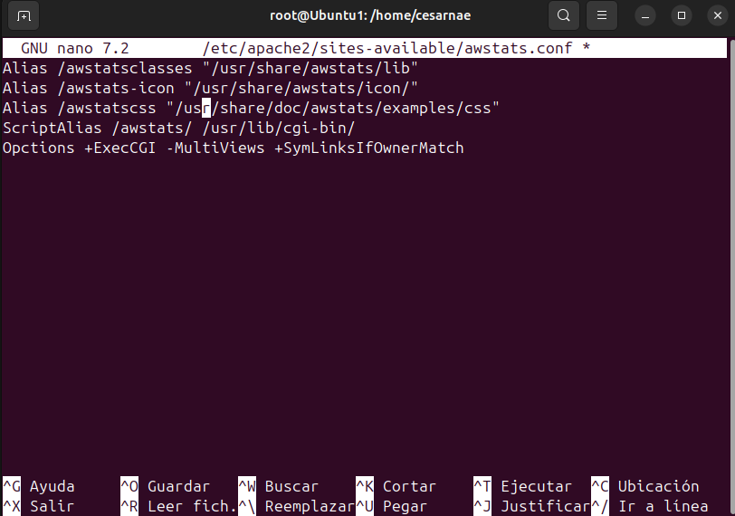

**Habilitamos conf**

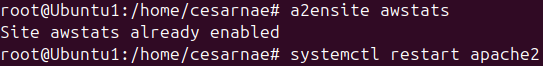

**Entramos navegador y vemos stats**

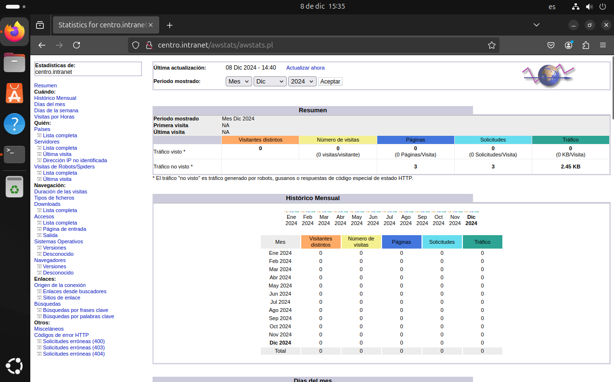

## 6. Instala un segundo servidor de tu elección (nginx, lighttpd) bajo el dominio  “servidor2.centro.intranet”. Debes configurarlo para que sirva en el puerto 8080 y haz los cambios necesarios para ejecutar php. Instala phpmyadmin.

**Instalamos nginx**

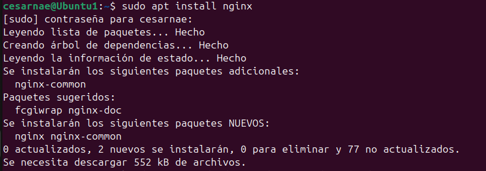

**Modiifcamos archivo para que escuche puerto 8080**

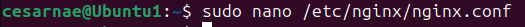

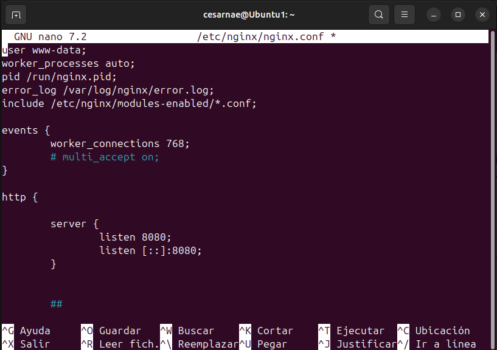

**Creamos fichero conf y modificamos para que escuche puerto 8080**

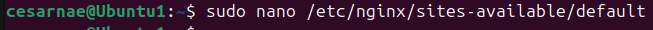

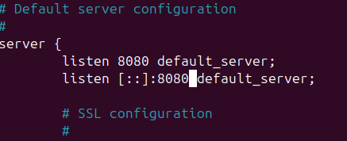

**Creamos directorio(almacenar archivos server) e index**

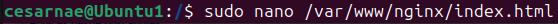

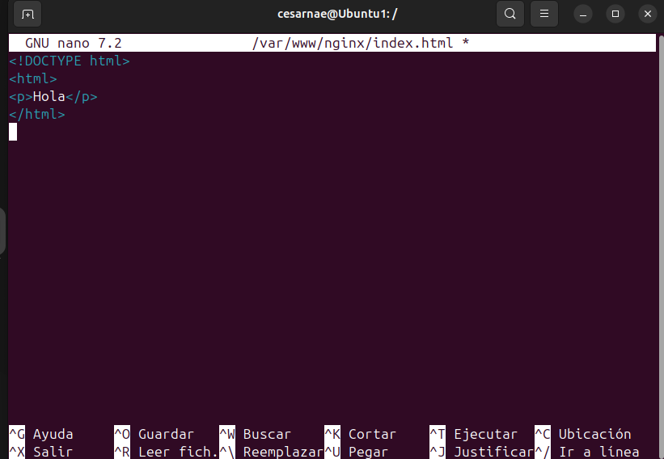

**Entramos a fichero conf, cambiamos root para nuevo directorio y añadimos el nombre de nuestro servidor(servidor2.centro.intranet)**

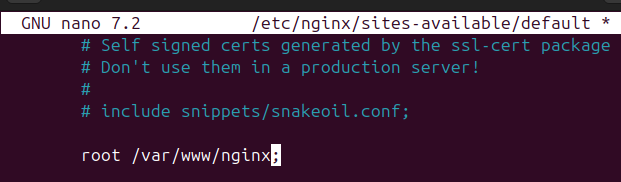

**Añadimos dominio a fichero hosts**

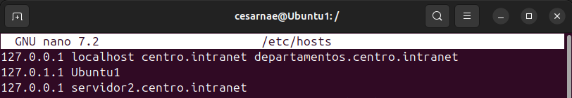

**Entramos a server con nombre dominio y puerto(servidor2.centro.intranet:8080)**

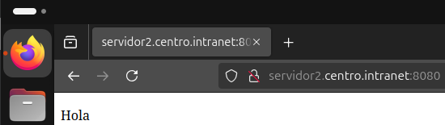

**Instalamos phpmyadmin(sudo apt install phpmyadmin) y elegimos apache2**

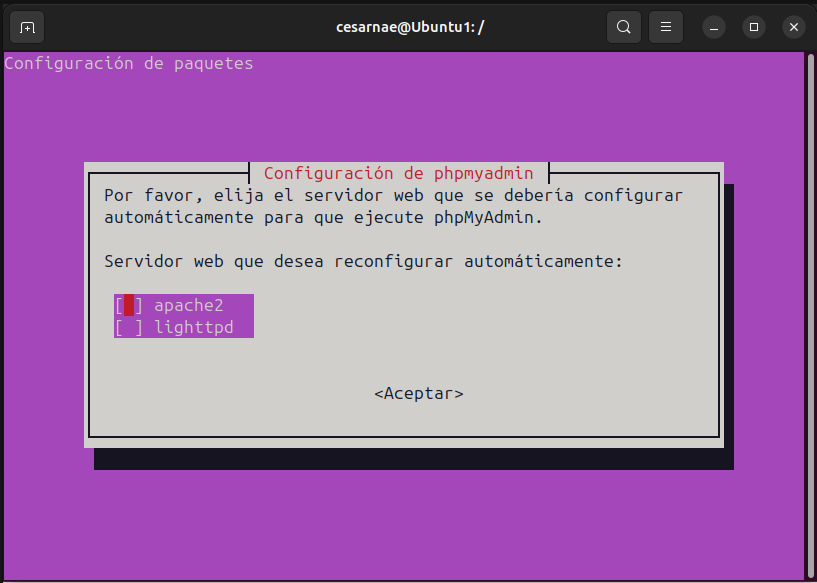

**Creamos enlace de entrada**

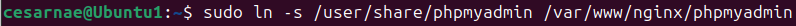

**Cmabiamos permisos**

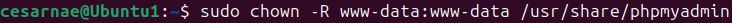

**Añadimos lo siguiente a nuestro fichero conf**

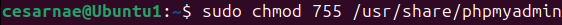

**Añadimos lo siguiente a nuestro fichero conf**

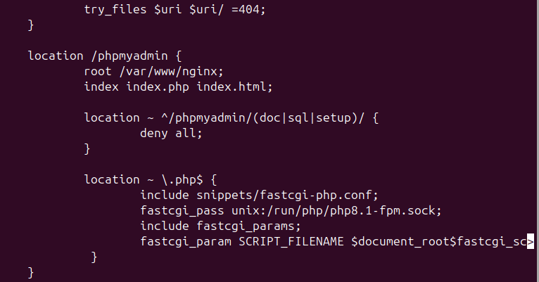

**Instalamos php8.1-fpm**

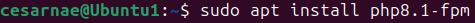

**Entramos a phpmyadmin poniendo en el navegador servidor2.centro.intranet:8080/phpmyadmin**

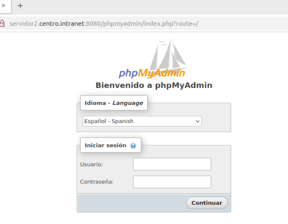

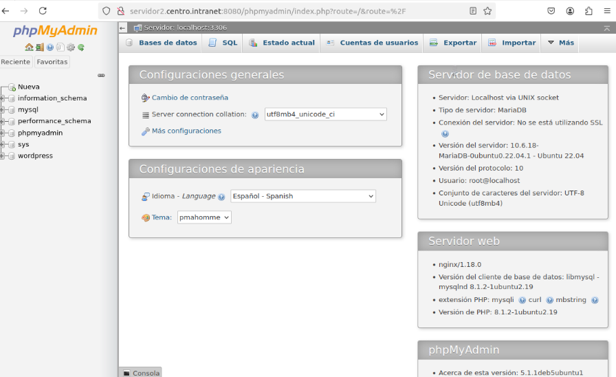

