# Trabajo 1º Trimestre.Servidores Web
## 1. Instalación del servidor web apache. Usaremos dos dominios mediante el archivo hosts: centro.intranet(wordpress) y departamentos.centro.intranet(Python)

**Instalación** servidor web apache:

 

**Comprobacion** de que esta bien instalado:

 

## 2.Activar los módulos necesarios para ejecutar php y acceder a mysql

**Instalación** MySQL:

 

**Comprobación**:

 
 
**Instalación** PHP:

 
 

**Comprobación**:

 

 **Creacion dominios mediante el archivo hosts:**

 
 
 **Comprobacion**:
 
 http://centro.intranet/

 

 http://departamentos.centro.intranet/

 

## 3. Instalar y configurar wordpress(centro.intranet)

**Instalacion en centro.intranet**

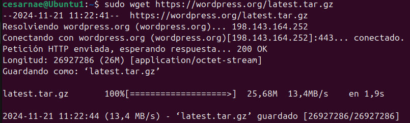

**Descomprimimos la carpeta**

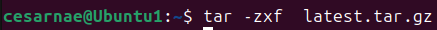

**La movemos a nuestro directorio**

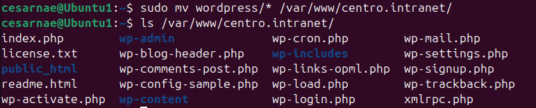

Ahora vamos a **configurar  el fichero virtualhost:**

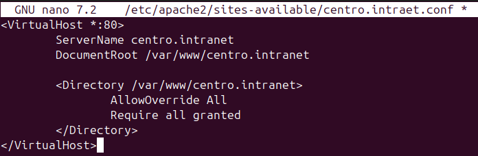
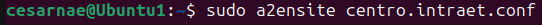
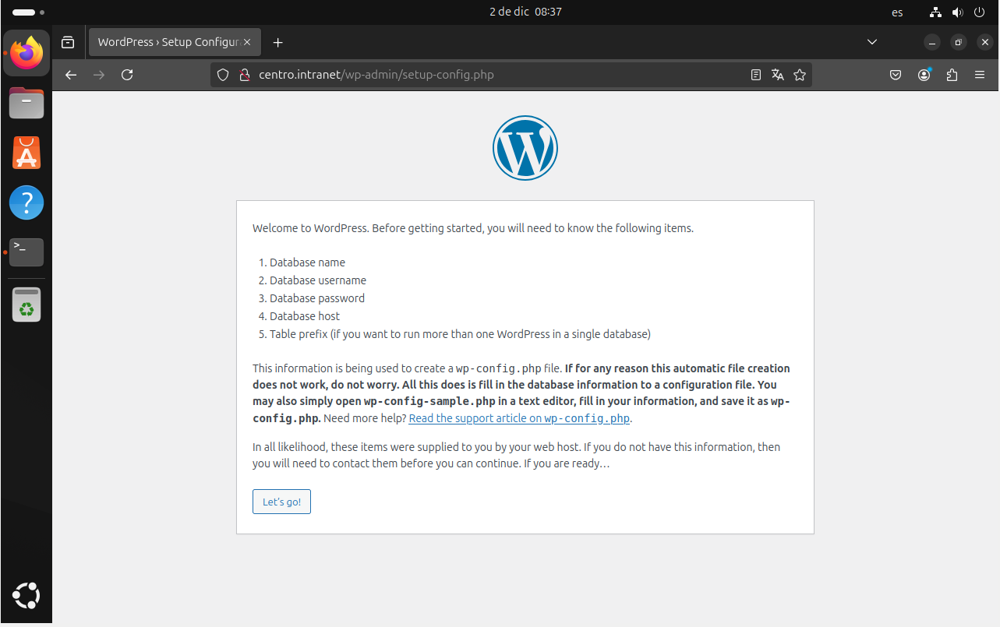
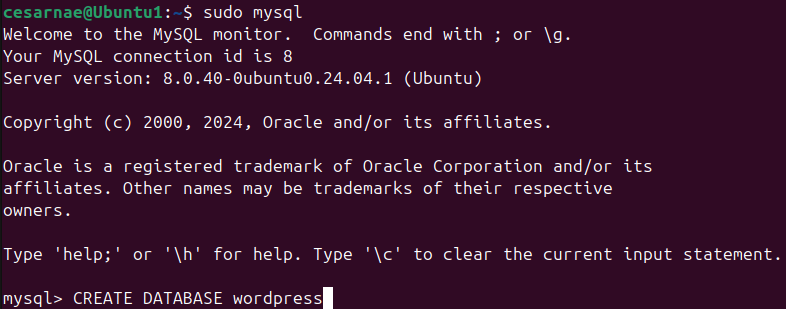
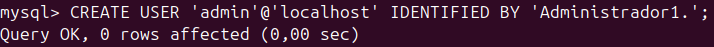
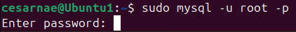
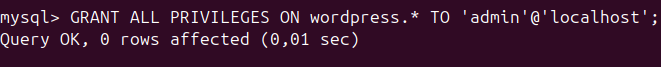
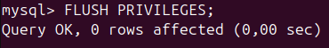
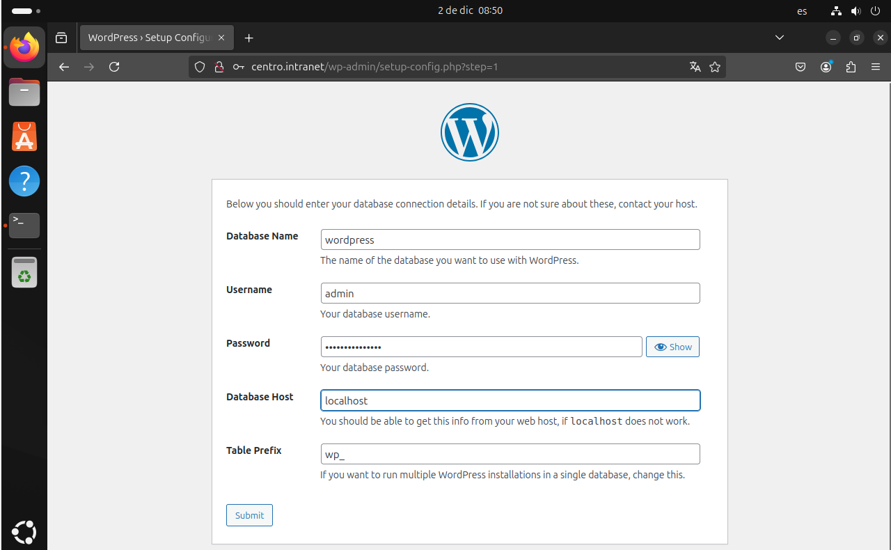
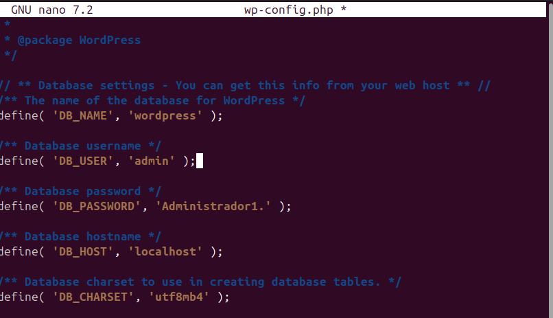
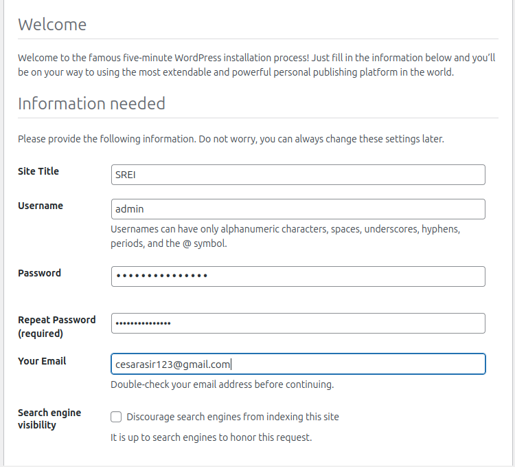
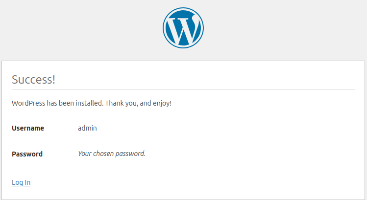
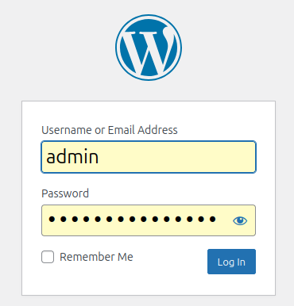
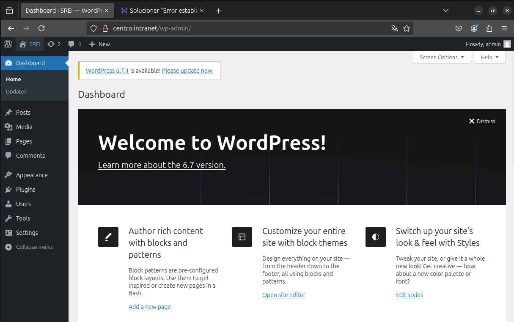

## 4. Activar el módulo “wsgi” para permitir la ejecución de aplicaciones Python

## 5. Activar el módulo “wsgi” para permitir la ejecución de aplicaciones Python
## 5.1 Crea y despliega una pequeña aplicación python para comprobar que funciona correctamente.

